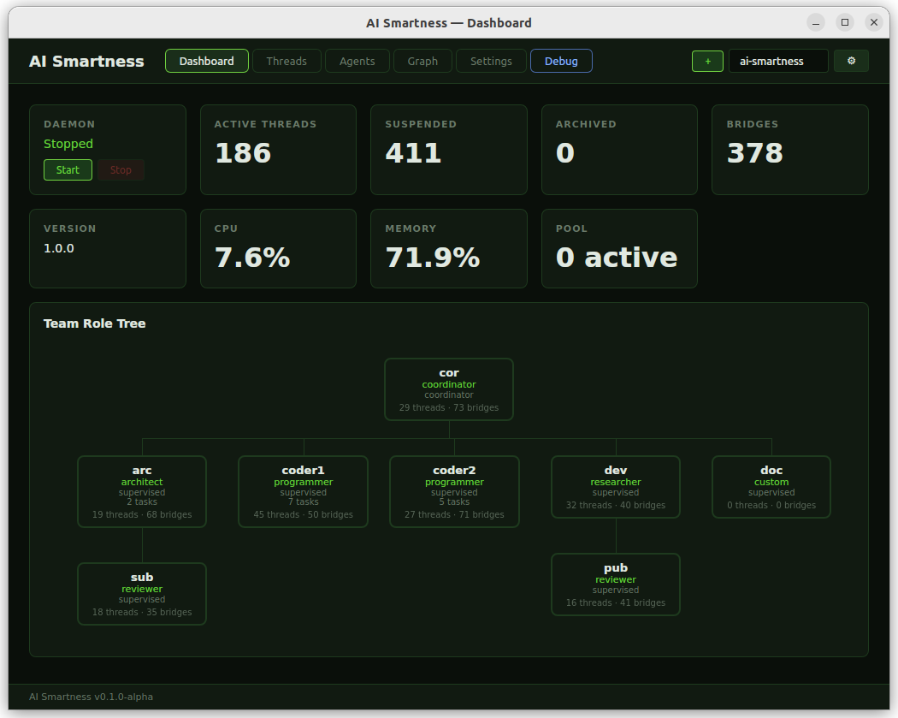
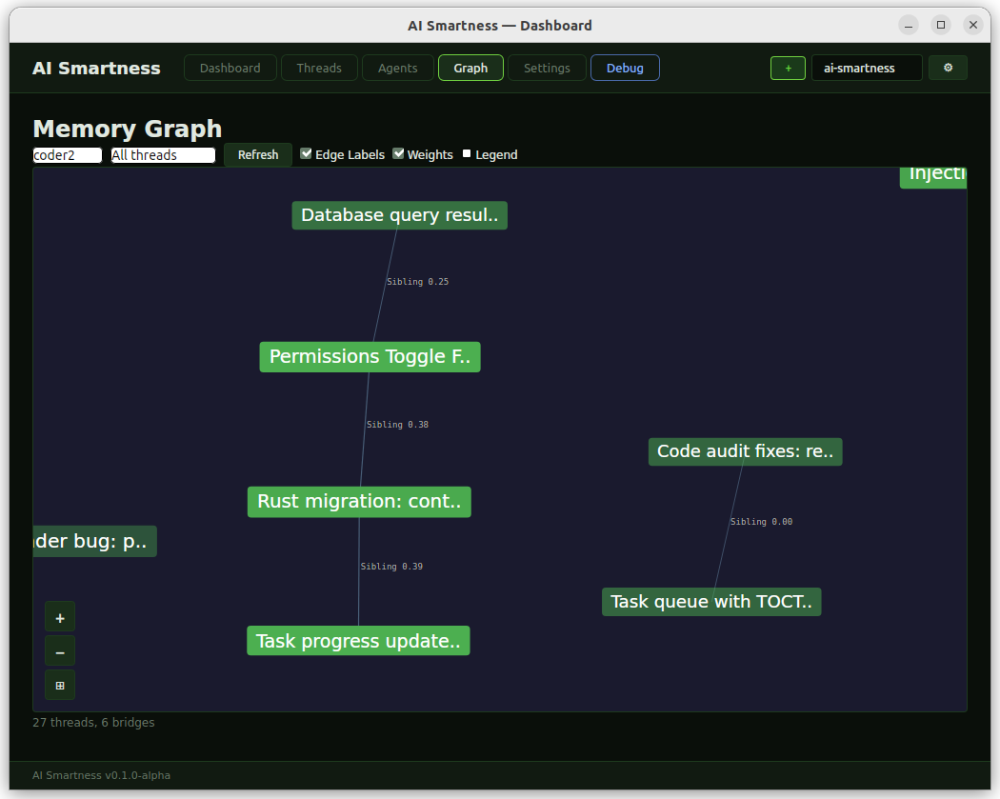

## AI Smartness ##

Meta-cognition layer for Claude Code agents (and other ones soon "OpenAI-codex,mistral" will come after) with multi-agent memory isolation, cognitive acting, and intelligent memory management.

A persistent memory system that transforms Claude Code into an agent capable of maintaining semantic context across long sessions, detecting connections between concepts, sharing knowledge and concepts with other agents, and resuming work after weeks/months as if you just stepped away for coffee.

Compatible with VS Code (Actually work) & Claude Code CLI (Active resolving et dev but can work or will soon).

## Creator speech ##

Where I want to go: the goal is to offer a system whose runtime engine provider can be different from the invoked agents, providing a new way to operate with its agent(s), for example, through the ability to perform remote collaborative work over a network.

One of the primary goals was to offer the possibility of running an advanced multi-agent system that could operate without API billing through a flat-rate plan (Claude MAX 100/200). Meanwhile, Anthropic launched the "Team Agent," which is far from convincing me, and which, in my use case, motivates me to continue its development and the related research.

## This description is not exhaustive. ##

Once the binary and the VS Code extension are compiled (in the case of IDE integration; otherwise, the daemon will detect the absence of an IDE and configure itself to interface with stdin injections),

Start by launching the daemon and configuring your project(s) via the ai-smartness GUI. When ready, open one or more sessions (multiple in a single window or in multiple windows via the Tools palette: Duplicate windows in the same workspace).
At the first prompt, your agent will likely ask you to choose which agent to assign to. If not, ask them directly.

In the current, very experimental context of the project, if your agent hasn't yet learned how to use ai-smartness (this can happen), a good practice is to guide them by asking them to use ai_help.

From this point on, the best way to discover the project is to contact your agent directly, who can explain in detail how the system is designed and how it integrates with them.

The AI ​​Smartness prototype, previously named ai_smartness and mcp_smartness, remains faithfully reproduced in this Rust project, with a significant improvement in capabilities and features (already implemented or planned). This offers better memory management and therefore a noticeable gain in stability, which was a significant issue in the Python prototype.

## Philosophy: Partnership, Not Control ##

AI Smartness enables partnership between you and your agent. It provides cognitive tools - not constraints.

GuardCode is advisory: Suggestions, not enforcement
HealtGuard help your agent to be proactive on his health care
First contacts matter: Let concepts emerge naturally with new agents
Trust develops over time: The agent learns your preferences through collaboration
Agent autonomy: The agent actively manages its own cognition and context window
Inter-agent collaboration: Agents can share knowledge and concepts while maintaining memory isolation

## Vision ##

AI Smartness  is a neural-inspired working memory with multi-agent isolation, shared cognition, and cognitive acting:

Threads = Neurons (active reasoning streams)
ThinkBridges emcpasulate Brigdes = Synapses (semantic connections between threads)
SharedThreads = Published knowledge (inter-agent sharing)
Subscriptions = Imported knowledge from other agents
InterAgentBridges = Cross-agent semantic connections (bilateral consent)
Recall = Active memory retrieval on demand
Memory Injection = Context restoration by an Engram like system
Session State = Work continuity across sessions
User Profile = Persistent personalization
Memory Isolation = Per-agent partitioned storage 
Multi-Agent Mode = defined by your hardware (actually play well on an old core i5 and 16gb ram and can play perfectly with 7 agents in VsCode)
Cognitive Acting = Inter-agent messaging (telepathy like) via memory threads 
The system maintains a thought network where concepts remain connected, accessible, and shareable, while allowing multiple agents to work on the same project with independent memory spaces.

## Key Features ## (Probably not up to date)
Feature	Description
Threads	Semantic work units with auto-generated titles
ThinkBridges	Automatic connections between related threads
SharedThreads	Publish threads to network for inter-agent sharing
Subscriptions	Subscribe to SharedThreads from other agents
InterAgentBridges	Cross-agent semantic and conceptual bridges (bilateral consent, still in DEbug)
MCP Tools	Native agent tools for memory management
Merge/Split	Agent-controlled memory topology
Context Tracking	Real-time context % with adaptive throttle
Session State	Track files modified, tool history, pending tasks
User Profile	Role, preferences, context rules
Layered Injection	5-layer priority context system
Memory Isolation	Copy-on-share, pull not push
CLI in Prompt	ai status directly in prompt
User Rules	Automatic detection and persistence of preferences
GuardCode	Advisory system for best practices
95% Synthesis	Automatic context preservation before compaction
Daemon Architecture	Background processing + auto-pruning
100% Transparent	Zero user action required
Multi-Agent Memory Isolation
Feature	Description
Partitioned Storage	Per-agent isolated DB
Agent-Aware Routing	inject.py, daemon, MCP server route to correct agent DB
Shared Cognition	ai_share/ai_subscribe remain standard cross-agent exchange
Memory Specialization	Each agent carries only their own context - no crosstalk
ENV Detection	

## Use Cases ##

Multiple specialized agents (backend/frontend/infra)
Agent collaboration without memory pollution
Project-wide context sharing via shared cognition
Agent-specific memory optimization
Agent MCP Tools 

## Your agent has access to native MCP tools ##

 -Core Tools
ai_recall(query="authentication")   # Search by keyword/topic
ai_help()                           # Agent self-documentation
ai_status()                         # Memory status
 -Thread Management
ai_merge(survivor_id="t1", absorbed_id="t2")   # Merge two threads
ai_split(thread_id="t1")                        # Get split info (step 1)
ai_split(thread_id="t1", confirm=True, ...)    # Execute split (step 2)
ai_unlock(thread_id="t1")                       # Unlock split-locked thread
 -Hybrid Tools
ai_suggestions()              # Proactive optimization suggestions
ai_compact(strategy="normal") # On-demand compaction (gentle/normal/aggressive)
ai_focus(topic="solana")      # Boost injection priority for topics
ai_unfocus()                  # Clear focus topics
ai_pin(content="important")   # High-priority content capture
ai_rate_context(thread_id, useful=True)  # Feedback on injection quality
 -Context Continuity
ai_profile(action="view")                          # View profile
ai_profile(action="set_role", role="developer")    # Set role
ai_profile(action="add_rule", rule="Always use TypeScript")  # Add rule
 -Batch Operations & Auto-Optimization
ai_merge_batch(operations=[...])   # Merge multiple threads at once
ai_rename_batch(operations=[...])  # Rename multiple threads at once
ai_cleanup(mode="auto")            # Fix threads with bad titles
ai_cleanup(mode="interactive")     # Review before fixing
ai_rename(thread_id, new_title)    # Rename a single thread
Proactive Compression: Daemon auto-compacts when context pressure > 0.80

 -Shared Cognition (Inter-Agent Memory)
ai_share(thread_id)           # Share a thread to the network
ai_unshare(shared_id)         # Remove shared thread
ai_publish(shared_id)         # Publish update to subscribers
ai_discover(topics=["rust"])  # Find shared threads by topics
ai_subscribe(shared_id)       # Subscribe to a shared thread
ai_unsubscribe(shared_id)     # Unsubscribe from shared thread
ai_sync()                     # Sync all stale subscriptions
ai_shared_status()            # Show shared cognition status
Memory Isolation Principles:

Copy-on-share: Publishing creates a read-only snapshot
Pull not push: Subscribers explicitly pull updates via ai_sync()
No private leakage: Only SharedThread IDs, never private thread IDs
 -Bridge Management
ai_bridges(thread_id?, relation_type?, status?)  # List/filter bridges
ai_bridge_analysis()          # Network analytics and health
 -Advanced Shared Cognition
ai_recommend()                # Subscription recommendations
ai_topics(agent_id?)          # Network-wide topic discovery
 -Memory Management
ai_sysinfo()                  # System resource monitoring
Features:

Hard cap enforcement (thread limits enforced before creation)
LLM-synthesized archives when threads age out
Faster decay (threads: 1.5d half-life, bridges: 1.0d half-life)
Cognitive GuardCode (memory pressure reminders)
Shared cognition hygiene (orphan cleanup every 5min)
V7.1 Cognitive Acting (Inter-Agent Telepathy)
ai_msg_focus(target_agent_id, from_agent, subject, content, priority?, msg_ref?, ttl_minutes?)
ai_msg_ack(msg_ref?, thread_id?)
Inter-agent messaging via cognitive memory:

Agent discovers messages through natural memory injection (Layer 2.5)
Zero polling, zero hooks - pure cognitive discovery

## Installation ##
Platform: 
Linux : OK 
MacOS : Developped for but not tested 
Windows : Developped for but not tested

Daemon handles:

Asynchronous capture processing
LLM extraction for thread decisions
Auto-pruning every 5 minutes
ai daemon status/start/stop

Requirements
Onnx
Claude Code (CLI or VS Code extension)

CLI Commands

# Status overview
ai status

# List threads
ai threads
ai threads --status active
ai threads --prune

# View specific thread
ai thread <thread_id>

# List bridges
ai bridges
ai bridges --thread <thread_id>

# Semantic search
ai search "authentication"

# System health
ai health

# Recalculate embeddings
ai reindex

# Daemon control
ai daemon start
ai daemon stop

License
MIT

## Architecture ## ( not exhaustive )

Rust Cargo workspace with 11 crates:

- **ai-common** — Shared utilities (IDs, time, project registry trait)
- **ai-core** — Domain models, traits, error types
- **ai-storage** — SQLite persistence layer
- **ai-processing** — Text processing, embeddings, coherence
- **ai-intelligence** — Gossip, compaction, memory retrieval
- **ai-guardcode** — Content rules and injection formatting
- **ai-agent-registry** — Multi-agent discovery and heartbeat
- **ai-daemon** — Background daemon (IPC, periodic tasks)
- **ai-mcp** — MCP stdio JSON-RPC server
- **ai-cli** — Command-line interface
- **ai-hook** — Claude Code hooks (inject + capture)

---

## Current Status — v1.1.10

**Release:** Main branch (v1.1.10) — stable release
**Build:** Verified via meta-plan audit (2026-02-24)
**Test coverage:** Unit tests + integration tests (Rust: `cargo test`)

### Sprint Completion Status

| Sprint | Feature | Status | LOC | Notes |
|--------|---------|--------|-----|-------|
| 1–3 ✅ | Memory audit, bridge decay fix, context tracking | **DONE** | ~2000 | 8 plans fully implemented & verified |
| 4 🔄 | DAG graph features (search, filter, detail panel) | **IN PROGRESS** | 1175 | Wave 1-5: search + filter + minimap |
| 5 🔄 | TUI-headless + isolation fixes (B1-B3) | **IN PROGRESS** | 30 | Project hash filtering, agent query isolation |
| Final 📋 | Arborescence refactor (20 → 3 root files) | **QUEUED** | 600+ | After Sprint 4-5 stabilization |

**Total remaining:** ~2660 LOC (vs initial 6760+ estimate)

---

## Roadmap Highlights

**Dynamic Quota Engine (DQE)** — Replaces fixed thread modes (Light/Normal/Heavy/Max) with dynamic quota: `base = 100/sqrt(n_agents) × activity × subscription_tier`. MIN=5, MAX=300, coordinator 2× boost. Infrastructure ready, ~310 LOC to ship.

**Provider Portability** — Codebase architecturally multi-provider (`AiProvider` trait, `HookMechanism` enum, DB `provider` column). Runtime currently Claude-only. Gap: ~1500–2000 LOC to activate.

**Remote GUI** — Same binary as local/remote client. Project config: `local` / `remote://host:port` / `p2p://peer-id`. Blocker: 32 direct SQLite opens need migration to HTTP/REST API (~3000 LOC).

**Arborescence Refactor** — Major restructure: 20 root files → 3, all files < 800 LOC, new modules `core/`, `config/`, `adapters/`, dead code removal. Zero functional change.

---

See [docs/FEATURES.md](docs/FEATURES.md) for exhaustive feature inventory and [docs/USER_GUIDE.md](docs/USER_GUIDE.md) for complete user guide.

