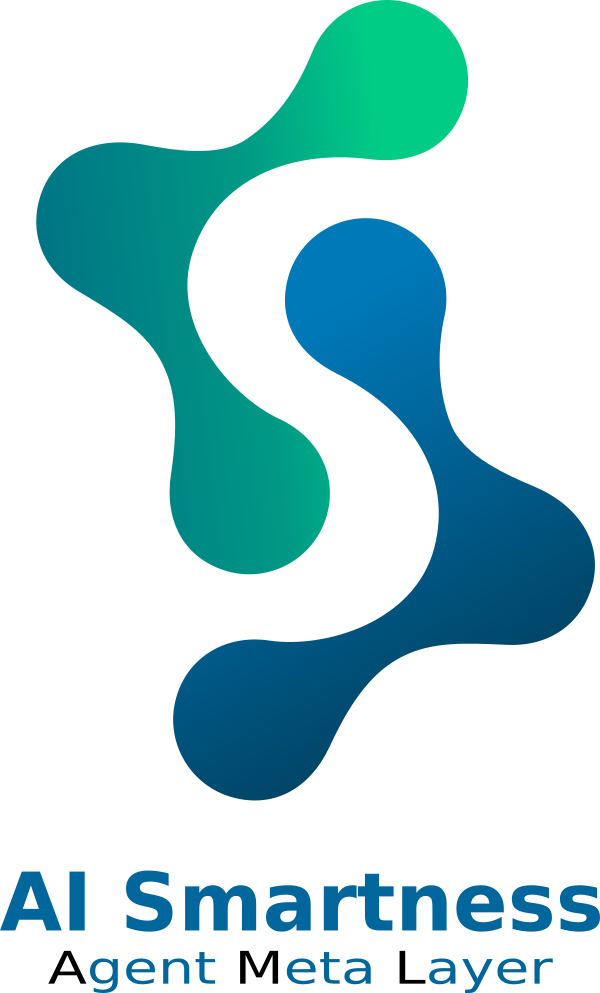
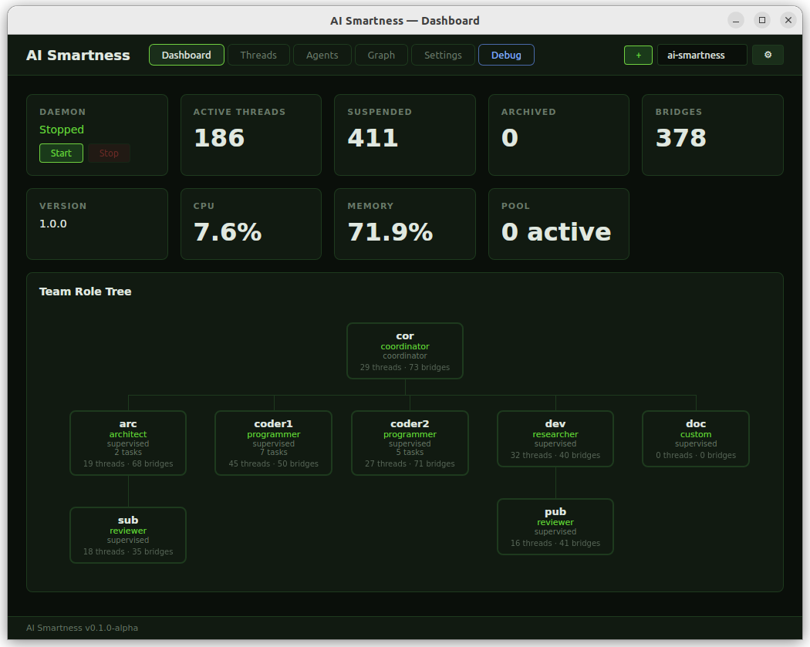
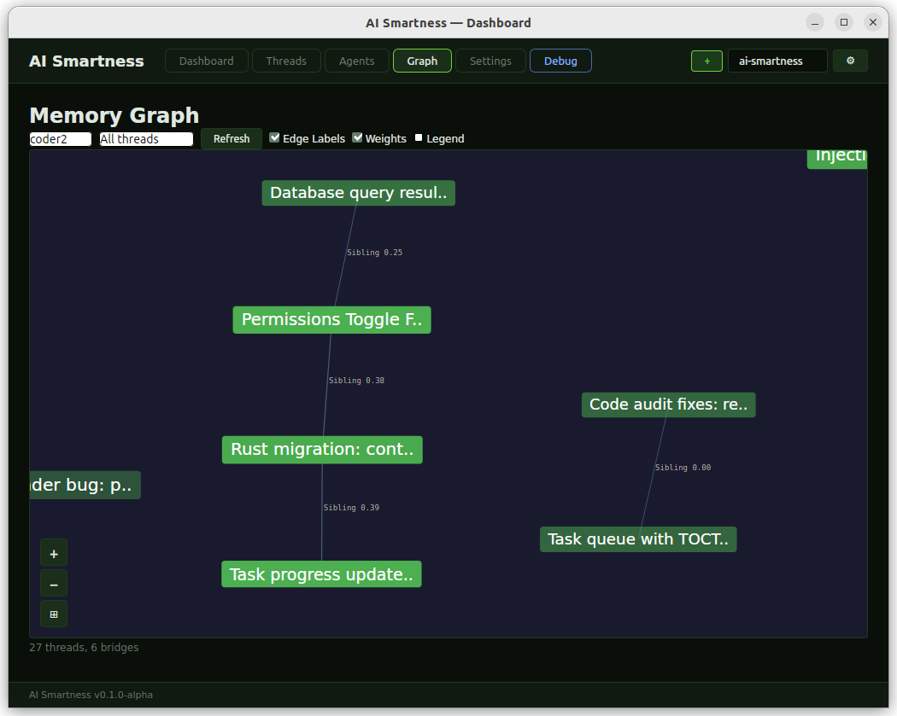

<p align="center">
  
</p>

<p align="center">
  <strong>Memoria cognitiva persistente para agentes IA</strong>
</p>

<p align="center">
  
  
  
</p>

<p align="center">
  <a href="README.md">English</a> |
  <a href="README_FR.md">Francais</a> |
  <a href="README_ES.md">Espanol</a>
</p>

---

## Que es AI Smartness?

AI Smartness es un runtime de memoria cognitiva persistente para agentes IA. Transforma Claude Code en un agente capaz de mantener contexto semantico a traves de sesiones largas, detectar conexiones entre conceptos, compartir conocimiento con otros agentes, y reanudar el trabajo despues de semanas como si acabaras de salir por un cafe.

El sistema funciona completamente en local — un LLM local (Qwen2.5-Instruct via llama-cpp-2 con GPU Vulkan) gestiona toda la extraccion de memoria sin ningun costo API. Ningun dato sale de tu maquina.


## Funcionalidades clave

- **Memoria persistente** — Los threads capturan cada interaccion significativa. Lecturas de archivos, ediciones de codigo, decisiones, razonamientos — todo se extrae y almacena en bases SQLite por agente
- **69 herramientas MCP** — Herramientas nativas para recall de memoria, gestion de threads, analisis de bridges, shared cognition, delegacion de tareas, mensajeria cognitiva, y mas
- **Bridges semanticos** — Descubrimiento automatico de conexiones entre threads via el sistema gossip (similitud coseno + superposicion de conceptos). Permite cadenas de memoria asociativa
- **Sistema multi-agente** — Memoria aislada por agente con shared cognition para intercambio de conocimiento inter-agentes. Jerarquia de supervision, delegacion de tareas, cognitive inbox
- **Inferencia LLM local** — Qwen2.5-Instruct 3B/7B via llama-cpp-2 (GPU Vulkan). Embeddings ONNX (all-MiniLM-L6-v2). Cero llamadas API para operaciones de memoria
- **Engram Retriever** — Pipeline de consenso de 10 validadores para decidir que threads inyectar en cada prompt. Proceso en 3 fases: pre-filtrado por hash, scoring, consenso
- **Auto-mejora** — File Chronicle, Mind Priority, Deep Recall, Session Handoff, Freshness Score, Annotation (v6.2-v6.8)
- **Panel GUI** — Navegador visual de threads, grafo DAG de bridges, jerarquia de agentes, editor de configuracion completo (Tauri/WebKit)
- **Sistema de hooks** — Integracion transparente con Claude Code via los hooks inject, capture, pretool y stop
- **4 modos de ejecucion** — CLI, Servidor MCP (JSON-RPC stdin/stdout), Daemon (segundo plano), GUI (escritorio)



## Inicio rapido

```bash
# Clonar y compilar
git clone https://github.com/VzKtS/ai-smartness
cd ai-smartness
cargo build --release

# Descargar ONNX Runtime + modelo de embeddings
ai-smartness setup-onnx

# Iniciar el daemon
ai-smartness daemon start

# Inicializar su proyecto
cd /path/to/your/project
ai-smartness init

# Crear y seleccionar un agente
ai-smartness agent add cod --role programmer
ai-smartness agent select cod

# Abrir Claude Code — la inyeccion de memoria inicia automaticamente
```

Para soporte GUI, compilar con `cargo build --release --features gui` (requiere webkit2gtk, gtk3, libsoup en Linux).

## Vista general de la arquitectura

**Crate Rust unico** con 4 modos de ejecucion:

```
Claude Code <--hooks--> ai-smartness <--IPC--> Daemon
                |                                 |
          Servidor MCP                    Prune / Gossip / Pool
         (69 herramientas)               (procesamiento en segundo plano)
                |
        3 bases SQLite:
        - agent.db     (memoria por agente)
        - registry.db  (registro global agentes/proyectos)
        - shared.db    (shared cognition por proyecto)
```

**Flujo de inyeccion de memoria:**
1. El usuario envia un prompt -> el hook inject se activa
2. El Engram Retriever ejecuta un consenso de 10 validadores sobre todos los threads activos
3. Los mejores threads + bridges + estado de sesion se inyectan (limite 8 KB)
4. El agente responde -> el hook capture procesa la salida
5. El daemon extrae threads, bridges, conceptos via el LLM local

**Componentes clave:**
- **ThreadManager** — Creacion de threads, hashing de contenido, deteccion de duplicados
- **Gossip v2** — Descubrimiento de bridges via ConceptIndex (pipeline de 5 pasos, cada 5 min)
- **Decayer** — Decaimiento exponencial con vida media para threads y bridges
- **Archiver** — Archivado de threads inactivos con sintesis LLM
- **RuleDetector** — Deteccion automatica de preferencias del usuario (patrones EN+FR)



## Documentacion

| Documento | Descripcion |
|----------|-------------|
| [FEATURES.md](docs/FEATURES.md) | Inventario exhaustivo de funcionalidades y detalles tecnicos |
| [User Guide (EN)](docs/USER_GUIDE.md) | Guia del usuario completa en ingles |
| [Guide Utilisateur (FR)](docs/USER_GUIDE_FR.md) | Guia del usuario completa en frances |
| [Guia del Usuario (ES)](docs/USER_GUIDE_ES.md) | Guia del usuario completa — instalacion, conceptos, herramientas MCP, configuracion |

## Requisitos

| Dependencia | Version | Notas |
|-----------|---------|-------|
| Rust | >= 1.85 | `rustup` recomendado |
| Claude Code | ultima | CLI o extension VS Code |
| ONNX Runtime | auto-descargado | `ai-smartness setup-onnx` |
| **Solo GUI:** webkit2gtk | 4.1 | `libwebkit2gtk-4.1-dev` |
| **Solo GUI:** GTK 3 | ultima | `libgtk-3-dev` |
| **Solo GUI:** libsoup | 3.0 | `libsoup-3.0-dev` |

**Plataformas:** Linux (totalmente soportado), macOS (implementado, aun no probado), Windows (implementado, aun no probado).

## Licencia

[MIT](LICENSE)

## Contribuir

Las contribuciones son bienvenidas. Por favor:

1. Haz un fork del repositorio
2. Crea una rama de funcionalidad (`git checkout -b feature/mi-funcionalidad`)
3. Haz commit de tus cambios
4. Empuja la rama (`git push origin feature/mi-funcionalidad`)
5. Abre un Pull Request

Para reportes de bugs y solicitudes de funcionalidades, abre un issue en [GitHub](https://github.com/VzKtS/ai-smartness/issues).
